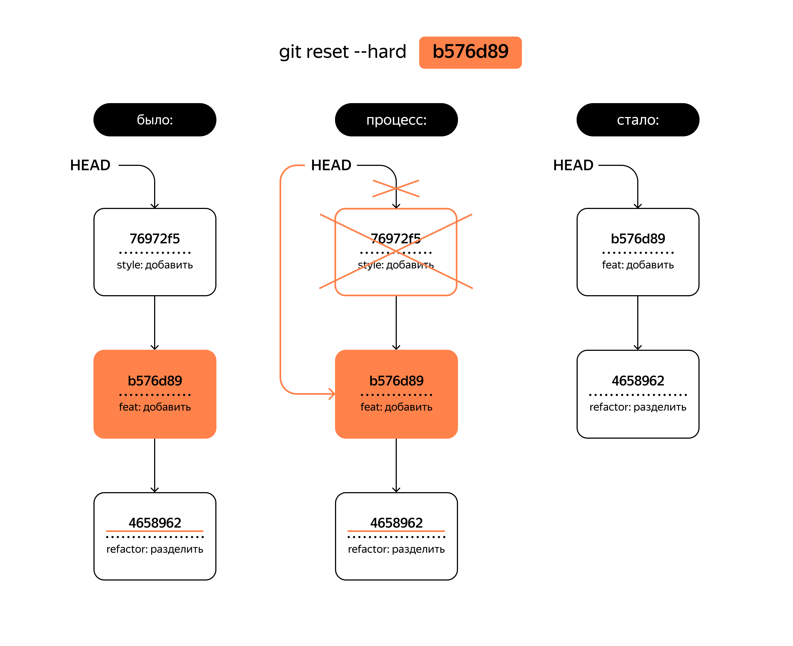

# Шпаргалка

### История

**Git** - система контроля версии, которая помогает отслеживать изменения в проекте. Git является консольный инструмент для работы с локальными и удаленными репозиториями.

### Основные команды

- `git init` - выполняет инициализацию репозитория. Создается папка .git которая хранит историю коммитов.
- `rm -rf .git` - данная команда помогает “разгитить” папку. По факту мы удаляем папку .git где храниться вся информация о нашем репозитории.
- `pbcopy` - копирует поток данных в буфер.
- `git status` - показывает состояние репозитория:
	- рабочая ветка.
	- список файлов над которыми проводились изменения с последнего коммита.
- `git add` - фиксирует состояние файла для дальнейшего сохранения.
- `git restore --staged <file>` - удаляет файл из **staging** **area**.
- `git reset --hard <commit hash> - позволяет откатить состояние проекта до указанного коммита. При откате команда **удаляет** свежи коммиты! 
- `git commit` - сохраняет состояние файла,  флаг `-m`  используется для написания комментария к измененному файлу.
	- `git commit --amend` - данная команда позволяет внести изменения в последний `HEAD` коммит. Присвиваем файлу статус `staged` с помощю комманды `git add`, а затем выполняем `git commit --amend`(+`-m` или `--no-edit`)
- `git log` - журнал коммитов. Содержит описание коммита:хеш, автор, дата. Флаг `--oneline` выводит сокращенный лог с хеш коммита и его комментарием.
- `git remote add <name> <url>` - привязывает локальный репозиторий к удаленному.
- `git fetch <remote_name>` - загружает все изменения из  удаленного репозитория но не объединяет их с локальным. После `git ferch` вы можете решить вносить изменения в вашу локальную копию `git marge` или отклонить `git rebase`.
- `git pull` - выполняет схожую задачу как `git ferch` но автоматически вносит изменения в вашу локальную копию `git marge`, обновляя до последней версии.
- `git push` - отправляет изменения с лок. репозитория на удаленный, используется флаг `-u` при первой отправке `git push -u origin main`

### Статусы файлов в **Git**
 
Все фыйлы деляться на два основных статуса `tracked` и `untracked` когда мы создаем новый файл в репозитории, 
то ему присваивается статус `untracked`, после команды `git add <file>` файлу присваивается статус `tracked` + `staged`.
Файл со статусом `tracked` может иметь два дополнительный статуса `staged` и `modified`.
- `staged` - присваивается после выполения комманды `git add`
- `modified` - присваивается если файл был со статусом `tracked` (+`staged`) и в него внесли извенения 
 

1. Файл только что создали. Git ещё не отслеживает содержимое этого файла. Состояние: untracked.
2. Файл добавили в **staging** **area** с помощью `git add`. Состояние: `staged` (+ `tracked`).
	- Возможно, изменили файл ещё раз. Состояния: `staged`, `modified` (+ `tracked`).

	Обратите внимание: `staged` и `modified` у одного файла, но у разных его версий.
	- Ещё раз выполнили `git add`. Состояние: `staged` (+ `tracked`).
3. Сделали коммит с помощью `git commit`. Состояние: `tracked`.
4. Изменили файл. Состояние: `modified` (+ `tracked`).
5. Снова добавили в **staging** **area** с помощью `git add`. Состояния: `staged` (+ `tracked`).
6. Сделали коммит. Состояния: `tracked`.
7. Повторили пункты 4−7 много-много раз.

---

### Откат состояния проекта 

### Сравнение 
Для сравнения версий используется команда `git diff`.
- `git diff` - сравнивает изменение в проекте текущего состояния `modified`/`untracked` с последним коммитом.
- `git diff --staged` - сравнивает файлы из **staging** **area** с последним коммитом.
- `git diff <commit hash> <commit hash>` -сравнивает изменения в двух коммитах, можно использвать `HEAD`, потому что `HEAD` указывает на последний коммит.

### **Работа с ветками (branch)**

- `git branch` - показать все ветки репозитория.
- `git branch <branch_name>` - создать новую ветку.
- `git branch -D <branch_name>` - удаление вети. Флаг `-d` удалит ветку только если она была полностью объединена с другой — то есть если две ветки стали (или изначально были) частью одной истории.
- `git branch -M <new_name>` - изменить имя вети. 
- `git checkout <branch_name>` - переулючиться на другую ветку.
- `git checkout -b <branch_name>` - создать и перейти на новую ветку.